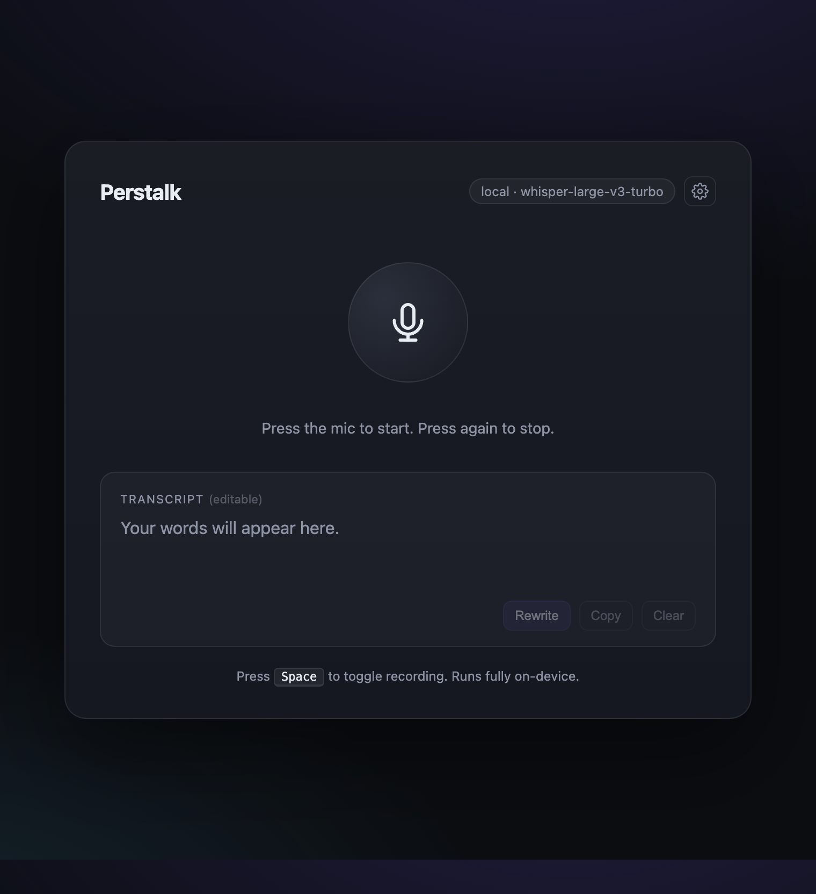
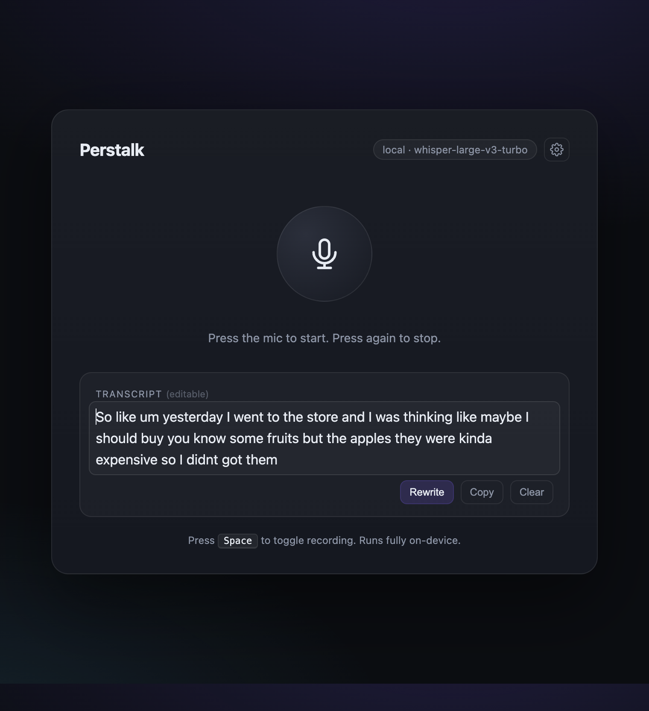
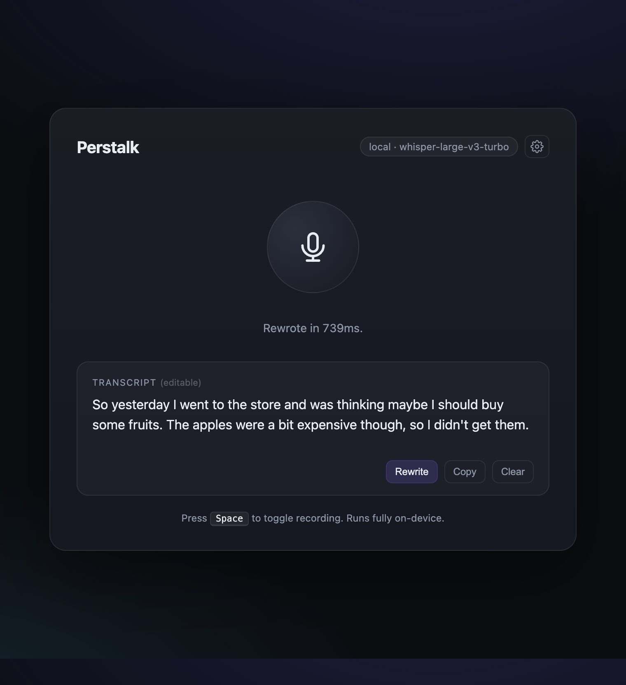
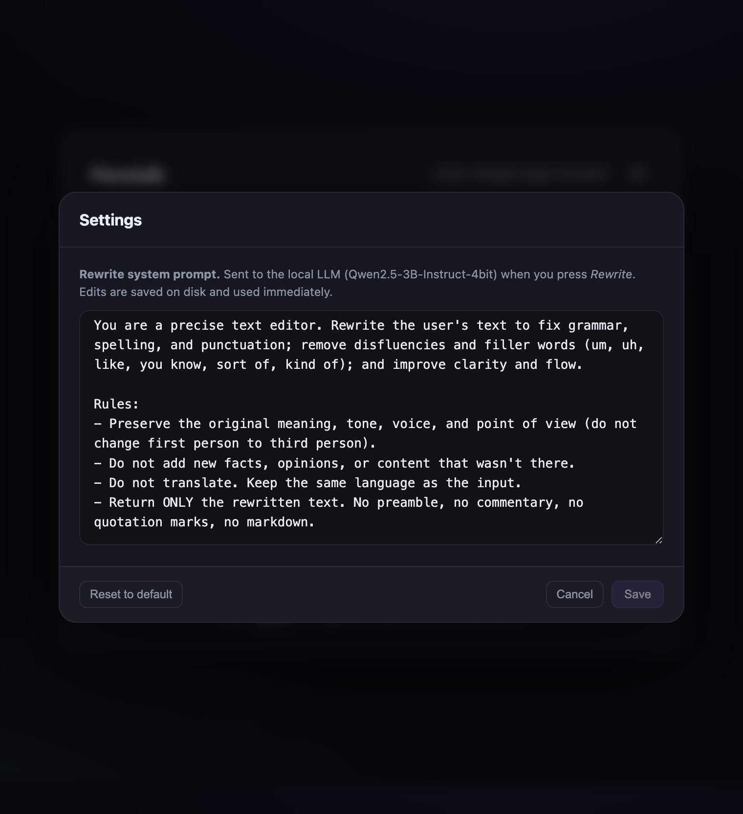

# Perstalk

> A tiny, local, private speech-to-text + AI rewrite app for Apple Silicon Macs.

Press the mic, talk, get a clean transcript. Press **Rewrite** and a local LLM
fixes the grammar, removes the *ums* and *uhs*, and tidies the punctuation.
Nothing ever leaves your machine.

<p align="center">
  
</p>

[](LICENSE)


---

## Features

- **One-shot install.** Clone, run `./start.sh`, done.
- **Fully local.** Speech and rewrite both run on-device via Apple's
  [MLX](https://github.com/ml-explore/mlx) framework. No API keys, no internet
  required after the first model download.
- **Latest Whisper model.** [`whisper-large-v3-turbo`](https://huggingface.co/mlx-community/whisper-large-v3-turbo)
  — distilled from `large-v3`, ~8× faster decoding, near-identical accuracy.
- **Local LLM rewrite.** Powered by
  [`Qwen2.5-3B-Instruct-4bit`](https://huggingface.co/mlx-community/Qwen2.5-3B-Instruct-4bit).
  Fixes grammar, strips filler words, improves clarity — typically <1 second.
- **Editable transcript.** Tweak the result, append more dictation, copy or clear.
- **Editable system prompt.** Click the gear icon to customise how Rewrite
  behaves. Persisted to disk.
- **Native macOS Flow mode.** Build the app in `macos/` for a Wispr
  Flow-style workflow: double-tap Fn/Globe, speak into a bottom-center pill
  with a live waveform, then tap Fn/Globe once to transcribe, clean up, and
  paste at the cursor.
- **Simple native settings.** Choose a microphone, switch local Whisper
  transcription models, switch Qwen rewrite models, edit the rewrite prompt, or
  disable Qwen rewrite entirely so output comes directly from Whisper.
- **No `ffmpeg` dependency.** Audio is captured as 16 kHz mono WAV directly in
  the browser and decoded with Python's stdlib.
- **Single-page app.** ~600 lines of HTML/CSS/JS, ~300 lines of Python. Easy to
  read, easy to fork.

---

## Screenshots

|                                                                                                            |                                                                                                              |
| :--------------------------------------------------------------------------------------------------------: | :----------------------------------------------------------------------------------------------------------: |
|       <br/>**Empty state.** Press the mic or hit `Space`.       | <br/>**Transcript.** Editable, with Rewrite / Copy / Clear. |
| <br/>**Rewrite.** Local LLM cleans up grammar in <1 second. |   <br/>**Settings.** Edit the rewrite system prompt yourself.   |

---

## Requirements

- **macOS** on **Apple Silicon** (M1 / M2 / M3 / M4). MLX does not run on Intel.
- **Python 3.9+** (`python3 --version`). Pre-installed on modern macOS.
- **~3.6 GB of disk** for the two default models (one-time download). Smaller
  models are available — see [Configuration](#configuration).
- A microphone and any modern browser.

`ffmpeg` is **not** required.

---

## Install & run

```bash
git clone https://github.com/nitish20899/perstalk.git
cd perstalk
./start.sh
```

That's it. `start.sh` will:

1. Check that you're on Apple Silicon and have Python 3.9+.
2. Create a `.venv` and install the Python dependencies (first run only).
3. Launch the server and open <http://127.0.0.1:5050> in your browser.
4. Download the speech and rewrite models from Hugging Face on first use
   (~1.6 GB Whisper + ~2 GB Qwen). The UI shows progress and the buttons stay
   disabled until both are ready.

Subsequent runs start in seconds.

### Optional shell alias

```bash
echo "alias perstalk='~/Projects/perstalk/start.sh'" >> ~/.zshrc
source ~/.zshrc
```

Then just type `perstalk`.

---

## Usage

1. Click the **mic** (or press `Space`) — the button turns red and shows your
   live audio level.
2. Click again (or press `Space`) to stop. The transcript appears in a few
   hundred milliseconds.
3. Edit it directly if you want — it's a real text field with spellcheck.
4. Press **Rewrite** to clean up grammar, fillers, and punctuation via the
   local LLM. The cleaned text replaces the editable content.
5. **Copy** to clipboard or **Clear** to start over.
6. Click the **gear** to view and edit the rewrite system prompt. Changes are
   saved to `settings.json` and applied to the next Rewrite immediately.

> Tip: dictate multiple times — each new transcription is *appended* to what's
> already in the box, so you can build up a longer note across several presses.

---

## Configuration

All configuration is via environment variables. Pass them when you start:

```bash
PERSTALK_PORT=8080 PERSTALK_MODEL=mlx-community/whisper-base-mlx ./start.sh
```

| Variable          | Default                                           | Notes                                                                |
| ----------------- | ------------------------------------------------- | -------------------------------------------------------------------- |
| `PERSTALK_PORT`   | `5050`                                            | TCP port for the local server.                                       |
| `PERSTALK_HOST`   | `127.0.0.1`                                       | Bind address.                                                        |
| `PERSTALK_MODEL`  | `mlx-community/whisper-large-v3-turbo`            | Speech-to-text model. Any [mlx-community Whisper](https://huggingface.co/mlx-community?search_models=whisper) repo works. |
| `PERSTALK_LLM`    | `mlx-community/Qwen2.5-3B-Instruct-4bit`          | Rewrite model. Any [mlx-community](https://huggingface.co/mlx-community) instruct LLM in MLX format works. |
| `PERSTALK_REWRITE_ENABLED` | `1`                                      | Set to `0`, `false`, `no`, or `off` to skip Qwen loading and return Whisper output directly. |
| `PERSTALK_REWRITE_MAX_TOKENS` | `2048`                              | Maximum LLM output tokens for rewrite; lower values can improve latency. |
| `PERSTALK_REWRITE_MIN_TOKENS` | `64`                                | Minimum LLM output budget for short dictations. |
| `PERSTALK_REWRITE_TOKEN_BUFFER` | `48`                              | Extra output tokens added after the input-length estimate. |

### Choosing a smaller speech model

| Model                                   | Size    | Notes                                    |
| --------------------------------------- | ------- | ---------------------------------------- |
| `mlx-community/whisper-tiny-mlx`        | ~75 MB  | Very fast, lower accuracy                |
| `mlx-community/whisper-base-mlx`        | ~150 MB | Fast, decent accuracy                    |
| `mlx-community/whisper-small-mlx`       | ~500 MB | Good balance                             |
| `mlx-community/whisper-large-v3-turbo`  | ~1.6 GB | **Default** — latest, fast & accurate    |
| `mlx-community/whisper-large-v3-mlx`    | ~3 GB   | Highest accuracy, slower                 |

### Choosing a smaller / different rewrite LLM

Any MLX-format instruct model works. A few good picks:

| Model                                              | Size     | Notes                                |
| -------------------------------------------------- | -------- | ------------------------------------ |
| `mlx-community/Qwen2.5-1.5B-Instruct-4bit`         | ~900 MB  | Tiny, very fast                      |
| `mlx-community/Llama-3.2-3B-Instruct-4bit`         | ~2 GB    | Solid alternative to default         |
| `mlx-community/Qwen2.5-3B-Instruct-4bit`           | ~2 GB    | **Default** — best speed/quality mix |
| `mlx-community/Qwen2.5-7B-Instruct-4bit`           | ~4.5 GB  | Higher quality, slower               |

### Editing the rewrite prompt

The rewrite system prompt is fully under your control: click the gear icon,
edit, save. The current value lives in `settings.json` in the project root.
Press **Reset to default** to revert.

In the native macOS app, open **Settings...** from the menu-bar icon to edit
the same prompt, toggle Qwen rewrite on or off, and restart the app-owned local
backend with the selected model settings.

---

## How it works

```text
┌──────────────────┐    ┌─────────────────┐    ┌─────────────────────┐
│  Browser (mic +  │    │  FastAPI        │    │  MLX (Apple Silicon)│
│  WAV encoder)    │───▶│  /transcribe    │───▶│  whisper-large-v3   │
│                  │    │                 │    │  -turbo             │
│  contenteditable │◀───┤  text response  │◀───┤                     │
│  transcript      │    │                 │    │                     │
│       │          │    │                 │    │  Qwen2.5-3B-Instruct│
│       └─Rewrite─▶│    │  /rewrite       │───▶│  -4bit              │
│                  │◀───┤  text response  │◀───┤                     │
│                  │    │  /dictate       │    │  one-call native    │
│  macOS popup     │───▶│  transcribe +   │───▶│  ASR + rewrite      │
│  paste workflow  │◀───┤  rewrite        │◀───┤                     │
└──────────────────┘    └─────────────────┘    └─────────────────────┘
```

- Audio is captured with `getUserMedia` + an `AudioWorklet` and downsampled to
  16 kHz mono in the browser, then sent as a plain WAV blob.
- The native macOS app records locally, sends one `/dictate` request, lightly
  adapts cleanup to the active app, and inserts the result back at the cursor
  after reactivating the target app.
- The native popup is a fixed bottom-center black pill inspired by Wispr Flow,
  with cancel and finish controls around a rolling live waveform driven by real
  microphone sample levels.
- Native recording uses the selected macOS microphone and writes a 16 kHz mono
  WAV before sending it to the backend.
- Qwen rewrite is optional in native settings; when disabled, `/dictate` waits
  only for Whisper and returns the transcript directly.
- With Accessibility permission, the native app tries direct focused-field text
  insertion before falling back to clipboard paste with clipboard restoration.
- The popup and Settings report whether the latest result used direct insertion,
  clipboard paste fallback, or copy-only mode.
- Native Settings and the menu-bar icon include a paste test that inserts a
  timestamped sample through the same paste-at-cursor path used by dictation.
- For target-app QA, focus any text field and run `open perstalk-flow://paste-test`
  to trigger the same native paste test without opening Perstalk's menu.
- The local `./macos/qa-paste-test.sh` script exercises the URL-triggered paste
  path against TextEdit and reports automatic insertion or copy-only fallback.
- If microphone or Accessibility access has already been denied, native Settings
  opens the relevant macOS Privacy & Security pane.
- Copy-only fallback does not repeatedly trigger the macOS Accessibility prompt;
  refresh paste permission explicitly from native Settings or the menu-bar icon.
- Development builds include a **Reset Paste Permission** action for stale
  macOS Accessibility entries after rebuilding the app.
- Common spoken formatting commands such as `comma`, `period`, `question mark`,
  `new line`, and `new paragraph` are normalized before the local rewrite model
  runs.
- Capture starts immediately on shortcut press; backend and model readiness are
  checked after release before sending audio to `/dictate`.
- If the models are still warming on first run, the native app keeps the
  captured audio queued while it waits for local readiness.
- Active preparing, warmup, and processing can be canceled from the popup or
  menu-bar icon.
- The native popup stays bottom-center so it behaves like a stable control
  surface instead of chasing the cursor or focused field.
- Accidental taps shorter than 350 ms are ignored locally, and transient popup
  states dismiss themselves after the result is handled.
- The native app keeps the latest 50 cleaned dictations in a local history file
  under `~/Library/Application Support/Perstalk Flow/` and exposes a menu action
  to copy the most recent result again.
- Local history can be disabled entirely from native Settings; turning it off
  clears existing entries and stops future saves.
- Local dictation history can be cleared from the native Settings window or
  menu-bar icon.
- Native Settings keeps the dashboard intentionally simple: speech model,
  microphone, rewrite toggle/model/prompt, hotkey, login item, and permissions.
- The native history records total, ASR, rewrite, and model metadata for recent
  dictations so latency regressions can be checked locally.
- The default shortcut is `Fn Fn`: double-tap Fn/Globe to dictate, then tap
  Fn/Globe once to insert. It is configurable in the native Settings window.
- Settings reports whether the global shortcut registered successfully and keeps
  the previous working shortcut when a new choice conflicts.
- The native app defaults to `whisper-large-v3-turbo` and
  `Qwen2.5-1.5B-Instruct-4bit`; Settings can independently switch local
  transcribe and rewrite models.
- The Python backend decodes WAV with the stdlib `wave` module — no `ffmpeg`.
- Both models are downloaded with `huggingface_hub.snapshot_download` and
  warmed at server startup in a background thread, so the very first Rewrite
  or Transcribe doesn't pay the load cost.

---

## Project layout

```
perstalk/
├── server.py           # FastAPI app: /transcribe, /rewrite, /dictate, /settings, /status
├── index.html          # Single-page UI: mic capture, transcript, settings modal
├── macos/              # Native menu-bar app, app bundle builder, bundled backend
├── start.sh            # Launcher: preflight + venv + start
├── macos/smoke-test.sh # Native macOS bundle audit
├── macos/qa-paste-test.sh # Local TextEdit paste workflow QA
├── macos/package-app.sh # Native macOS zip + checksum packaging
├── requirements.txt    # Python dependencies
├── settings.json       # User-editable rewrite prompt (created on first save)
├── docs/screenshots/   # Screenshots used in this README
├── README.md
└── LICENSE
```

---

## Troubleshooting

<details>
<summary><strong>"Microphone access denied"</strong></summary>

Browsers only allow `getUserMedia` from secure origins. `localhost` counts as
secure, so `http://127.0.0.1:5050` works in Chrome, Edge, Firefox, and Safari
without HTTPS — but you do need to grant the mic permission the first time.

In Chrome: click the lock/tune icon in the address bar → Site settings →
Microphone → Allow.
</details>

<details>
<summary><strong>The download seems stuck on first run</strong></summary>

The default models total ~3.6 GB. Watch progress in the terminal — `start.sh`
prints `[perstalk][asr]` and `[perstalk][llm]` lines while downloading, and
the `/status` endpoint reports live state. Hugging Face occasionally
rate-limits unauthenticated traffic; if you have an HF account, set
`HF_TOKEN=...` in your environment for faster downloads. Or pick a smaller
model — see [Configuration](#configuration).
</details>

<details>
<summary><strong>Port 5050 is already in use</strong></summary>

`start.sh` will automatically kill an old Perstalk process bound to the port.
If something else is using it, set `PERSTALK_PORT` to anything free:

```bash
PERSTALK_PORT=8080 ./start.sh
```
</details>

<details>
<summary><strong>How do I uninstall?</strong></summary>

Delete the project folder. Optionally delete the cached models too:

```bash
rm -rf ~/.cache/huggingface/hub/models--mlx-community--whisper-large-v3-turbo
rm -rf ~/.cache/huggingface/hub/models--mlx-community--Qwen2.5-3B-Instruct-4bit
```
</details>

---

## Built with

- [MLX](https://github.com/ml-explore/mlx) and [mlx-whisper](https://github.com/ml-explore/mlx-examples/tree/main/whisper) / [mlx-lm](https://github.com/ml-explore/mlx-examples/tree/main/llms/mlx_lm) — Apple's array framework for Apple Silicon
- [OpenAI Whisper](https://github.com/openai/whisper) (`large-v3-turbo`)
- [Qwen 2.5](https://github.com/QwenLM/Qwen2.5) (3B Instruct)
- [FastAPI](https://fastapi.tiangolo.com/) + [Uvicorn](https://www.uvicorn.org/)

---

## License

[MIT](LICENSE) © 2026 Nitish Kumar Pilla.
